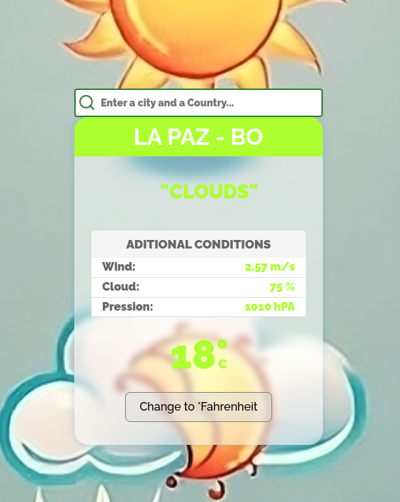

# Aplicación Meteorológica ReactJS

## ¡Conoce el clima en tiempo real!

Esta aplicación web, construida con ReactJS y Vite, te permite obtener información precisa sobre el clima en cualquier lugar del mundo. Busca una ciudad o utiliza tu ubicación actual para conocer la temperatura, viento, y más.

## Caracteristicas

- **Búsqueda de ciudades:** Encuentra fácilmente el clima de cualquier ciudad a nivel mundial.

- **Ubicación actual:** Obtén automáticamente el clima de tu ubicación actual.

- **Datos meteorológicos:**  Entre otros temperatura, viento y nubes.

- **Interfaz intuitiva:** Diseño moderno y fácil de usar, optimizado para diferentes dispositivos.

- **Componentes reutilizables:** : Estructura modular del código para facilitar el mantenimiento.

- **Personalización:** : Opciones de personalización para unidades de medida (Celsius/Fahrenheit).

- **Hooks:** Utiliza los hooks useState y useEffect para gestionar los parametros del clima. 

- **CSS:**  Estiliza la aplicación. 

- **JSON:** Almacena las frases en un archivo JSON. 

- **ReactJS:**  Framework JavaScript para crear interfaces de usuario. 

- **Vite:**  Herramienta de construcción de frontend rápida y basada en ES modules. 

- **Lucide Icons:** : Iconos personalizados para mejorar la interfaz.
 
Puedes visitar la plataforma en línea en [https://s02e02-weather-fmg.vercel.app/](https://s02e02-weather-fmg.vercel.app/)

## Requisitos del Sistema

- **Sistema Operativo:** Ubuntu 22.04.4 LTS o Windows 10 Pro 1803 

- **NodeJS:** Versión 18.20.4 o superior 

- **npm/npx:** Versión 10.8.4 o superior 

- **Vite::** version 5.4 o superior 

- **ReactJs:** vesion 18.3 o superior 
    
## Sistemas Alternativos Probados
El proyecto también ha sido probado en el siguiente entorno alternativo:

- **Sistema Operativo:** Windows 10 Pro 1803

- **NodeJS:** NodeJS: 18.20.4

- **npm/npx:** Versión 10.8.4 o superior 

- **Vite:** version 5.4 o superior 

- **ReactJs:** vesion 18.3 o superior 

## Contribuciones
Las contribuciones son bienvenidas. Si encuentras algún error o deseas agregar nuevas funcionalidades, no dudes en abrir un issue o una pull request en el repositorio.

## Imagenes

Pantalla principal 

## Comandos Útiles

Ver información del sistema:

uname -r

sb_release -a

node -v

npm -v

## Instalación

estructura del proyecto

## Estructura del proyecto

 ## Instalación

```
index.html
readme.md
└── src/
    ├── App.jsx
    ├── App.css
    ├── index.css
    ├── components/
    │   ├── ClimaCard.jsx
    │   └── BuscadorClima.jsx
    ├── assets/
    │   └── images/
    │       ├── 1Clearsky.jpg
    │       ├── ...
    │       ├── 9Mist.jpg
    │       ├──a_1_sunny.svg
    │       ├──...
    │       ├──g_4_waterdrop.svg
    │       ├── index.js
    │       └── rectangle.svg
    └── data/
        └── phrases.json
```

Bajar el proyecto del repositorio:

git clone https://github.com/fabinnerself/s02e02-weather-fmg.git

luego correr:

cd  s02e02-weather-fmg

npm install

npm install lucide-react

npm i axios

npm run dev

(C) 2024 Favian Medina Gemio


